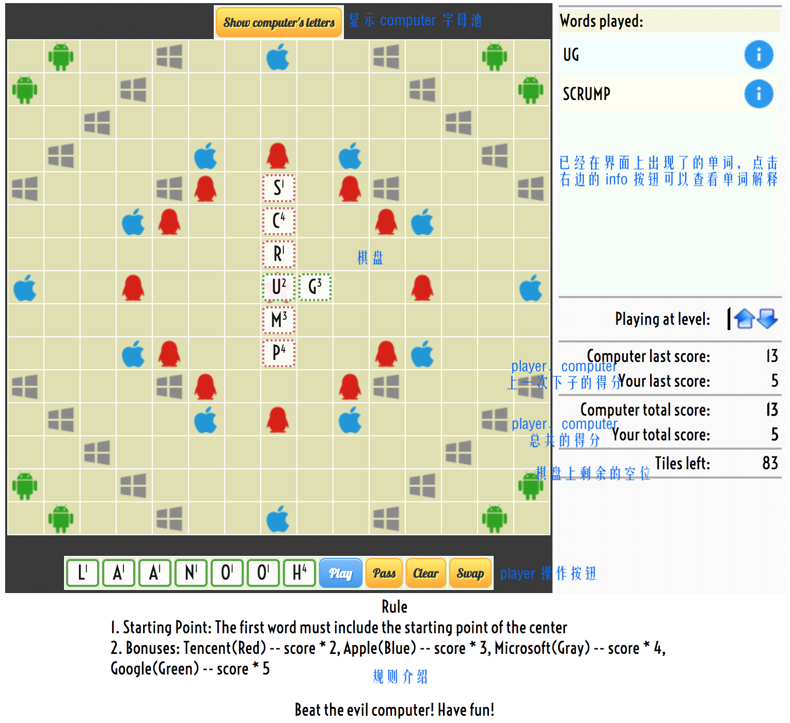
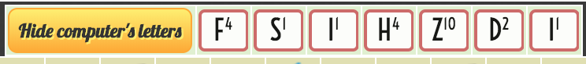
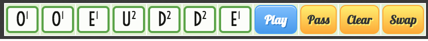

## Scrabble

### 简介

使用原生 js 实现的 Scrabble 拼字游戏，你可以与邪恶的电脑对抗，试图赢得胜利。完美支持 Chrome、Firefox、Safari、IE6+ 等浏览器。完美支持 Windows、Mac、Linux 等操作系统。

代码由执行游戏逻辑的引擎 engine.js 和实现游戏引擎用户界面的用户界面 ui.js 组成，还包括了一些小的配置 js。目前支持英文 word。

项目开源地址：https://github.com/FoxerLee/Scrabble

### 玩法介绍

**开始游戏**

直接在你的浏览器中运行 index.html 即可开始游玩

**界面说明**

右侧部分是一些信息显示，在这里可以查看已经在界面上出现的单词，也可以查看单词的解释。Playing at level 是用来限制 computer 的最高得分。再下面可以看到 player、computer 的得分情况以及棋盘上剩余的空位。

上方是 computer 的字母池，可以点击 hide 或者 show 按钮来隐藏或者偷窥 computer 的字母池～

下方是 player 的字母池和操作按钮。在完成下子之后，点击 play 按钮。如果不会下，可以点击 pass 按钮。clear 按钮可以清除掉放在了棋盘上的 letter。swap 按钮可以跳过并且替换部分 letter。

**规则说明**

- 计分：拼接成功的 letters 的上标分数求和，包括和已有的 letter，如果有包含加分点，再按照下面规则计算。
- 下法约束：每一次下子必须与原始的 letters 拼接在一起。
- 起始点：第一次下子必须包括中间的起始点 -- 五角星。
- 加分点：
  - Tencent（红色的 QQ icon）-- score * 2
  - Apple（蓝色的 Apple icon）-- score * 3
  - Microsoft（灰色的 Windows icon）-- score * 4
  - Google（绿色的 Android icon）-- score * 5

### 实现方法

**正则表达式**

关于 computer 实现寻找可填充的 word，采用的是 Javascript 的正则表达式来实现。现在的最长 word 为7个字符串，所有的可能的 word 都存放在 xx_wordlist.js 里面的 g_wstr 变量，存放方法是 \_"word"\_ 这样隔开然后成为一个 string，同时不同字长的 word 是分开的 string。

因此我可以生成对应的正则表达式进行匹配，下面是一个例子：

 

**..ad..sing** （点代表可填入的空位）

 

对于上面的一段 letter，我可以根据填充的位置可以先分为三种情况：

- 只填入前面
- 只填入后面
- 前面后面都填入

对于只填入前面，情况比较简单，就可以直接生成 **\_([a-z]{2})ad\_**、**\_([a-z]{1})ad\_** 这样的正则表达式，分别代表补 1 个 letter 和 2 个的情况。

对于只填入后面，要分两种情况考虑，只填入 1 个 letter 就会得到 **..adD.sing** 的结果，就不需要考虑后面的 sing，那么生成的正则表达式就是 **\_ad([a-z]{1})\_**；如果说填入了 2 个 letter，那么就要把后面的 sing 也放进去考虑，那么生成的正则表达式就是 **\_ad([a-z]{2})sing\_**。

前面后面都填入就是进行了一下综合而已。

**正交 word 计算**

在完成了一次 word 的拼接之后，我会计算其正交方向上与原始 letters 拼接而成的 words 的分数。具体方法是，首先确定新生成 word 的朝向为 x 轴还是 y 轴走向。然后针对 word 中逐个的 letter，判断其正交方向上是否有邻接的 letter，如果有，那么就继续计算更远一位，这样找出的 letters 再在 word_list 表中进行检索，看是否为一个真正的 word，如果是，就加上对应分数。

